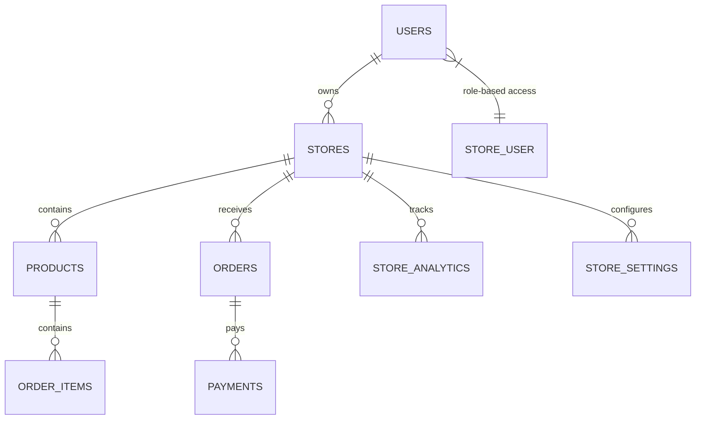

# 🛍️ KEVA Backend - Plateforme E-commerce Multi-Boutiques

<div align="center">
  
  
  
  
  
</div>

## 📋 Table des Matières

- [🎯 À Propos](#-à-propos)
- [✨ Fonctionnalités](#-fonctionnalités)
- [🏗️ Architecture](#️-architecture)
- [🚀 Installation](#-installation)
- [📚 Documentation API](#-documentation-api)
- [🏪 Système Multi-Boutiques](#-système-multi-boutiques)
- [🔐 Authentification & Autorisation](#-authentification--autorisation)
- [💳 Paiements](#-paiements)
- [📊 Analytics](#-analytics)
- [🧪 Tests](#-tests)
- [🚀 Déploiement](#-déploiement)
- [🤝 Contribution](#-contribution)

## 🎯 À Propos

**KEVA Backend** est une API REST complète pour une plateforme e-commerce multi-boutiques développée avec **Laravel 12** et **PHP 8.2**. Elle permet aux entrepreneurs gabonais de créer et gérer leurs boutiques en ligne avec un système d'abonnements, de paiements intégrés et d'analytics avancées.

### 🌟 Caractéristiques Principales

- **🏪 Multi-boutiques** : Gestion centralisée de plusieurs boutiques
- **👥 Gestion d'équipe** : Système de rôles et permissions par boutique
- **📦 Gestion avancée des produits** : Inventaire, variantes, images
- **🛒 Panier intelligent** : Validation multi-boutiques
- **📋 Gestion des commandes** : Workflow complet de commande
- **💳 Paiements intégrés** : Mobile Money, cartes bancaires
- **📊 Analytics temps réel** : Tableaux de bord et rapports
- **🔐 Sécurité avancée** : Authentification, autorisation, rate limiting
- **📱 API REST complète** : Documentation Swagger intégrée

## ✨ Fonctionnalités

### 🏪 Gestion des Boutiques
- **Création et personnalisation** de boutiques
- **Gestion d'équipe** avec rôles (owner, admin, manager, staff)
- **Paramètres personnalisés** par boutique
- **Analytics et statistiques** par boutique
- **Notifications** pour les gestionnaires

### 📦 Gestion des Produits
- **Catalogue complet** avec catégories
- **Gestion d'inventaire** avancée
- **Variantes de produits** (couleur, taille, etc.)
- **Images et médias** optimisés
- **Statuts de disponibilité** intelligents
- **SEO intégré** pour chaque produit

### 🛒 Système de Commandes
- **Panier multi-boutiques** avec validation
- **Workflow de commande** complet
- **Suivi des livraisons** en temps réel
- **Gestion des retours** et remboursements
- **Notifications automatiques** pour les clients

### 💳 Paiements & Facturation
- **Intégration EBILLING** pour le Gabon
- **Support Mobile Money** (Airtel, Moov)
- **Paiements par carte** bancaire
- **Facturation automatique** PDF
- **Gestion des remboursements**

### 📊 Analytics & Reporting
- **Tableaux de bord** en temps réel
- **Statistiques de ventes** par période
- **Analyse des performances** produits
- **Rapports clients** détaillés
- **Métriques de conversion**

### 🔐 Sécurité & Authentification
- **Laravel Sanctum** pour l'API
- **Système de rôles** et permissions
- **Rate limiting** intelligent
- **Validation des données** robuste
- **Logs d'audit** complets

## 🏗️ Architecture

### 🛠️ Stack Technologique
```
┌─────────────────────────────────────────────────────────────┐
│                    KEVA Backend Architecture                 │
├─────────────────────────────────────────────────────────────┤
│  🌐 API Layer (Laravel 12)                                 │
│  ├── Controllers (REST API)                                │
│  ├── Middleware (Auth, Rate Limiting, CORS)                │
│  └── Requests (Validation)                                 │
├─────────────────────────────────────────────────────────────┤
│  💼 Business Logic Layer                                    │
│  ├── Services (Business Logic)                             │
│  ├── Policies (Authorization)                              │
│  └── Traits (Reusable Code)                                │
├─────────────────────────────────────────────────────────────┤
│  🗄️ Data Layer                                             │
│  ├── Models (Eloquent ORM)                                 │
│  ├── Migrations (Database Schema)                          │
│  └── Seeders (Test Data)                                   │
├─────────────────────────────────────────────────────────────┤
│  🔌 Integration Layer                                       │
│  ├── EBILLING (Payments)                                   │
│  ├── File Storage (Images, PDFs)                           │
│  └── Email & SMS (Notifications)                           │
└─────────────────────────────────────────────────────────────┘
```

### 📊 Modèle de Données


## 🚀 Installation

### 📋 Prérequis
- **PHP 8.2+** avec extensions requises
- **Composer** pour la gestion des dépendances
- **Node.js 18+** pour les assets
- **SQLite** (ou MySQL/PostgreSQL)

### 🔧 Installation Locale

1. **Cloner le projet**
```bash
git clone https://github.com/votre-repo/keva-backend.git
cd keva-backend
```

2. **Installer les dépendances**
```bash
composer install
npm install
```

3. **Configuration de l'environnement**
```bash
cp .env.example .env
php artisan key:generate
```

4. **Configuration de la base de données**
```bash
# Créer la base de données SQLite
touch database/database.sqlite

# Configurer dans .env
DB_CONNECTION=sqlite
DB_DATABASE=/chemin/vers/keva-backend/database/database.sqlite
```

5. **Exécuter les migrations et seeders**
```bash
php artisan migrate --seed
```

6. **Générer la documentation API**
```bash
php artisan l5-swagger:generate
```

7. **Lancer l'application**
```bash
php artisan serve
```

L'API sera accessible sur `http://localhost:8000`

### 🐳 Installation avec Docker

```bash
# Construire l'image Docker
docker-compose build

# Lancer les services
docker-compose up -d

# Installer les dépendances
docker-compose exec app composer install

# Exécuter les migrations
docker-compose exec app php artisan migrate --seed
```

## 📚 Documentation API

### 🔗 Accès à la Documentation
- **Swagger UI** : `http://localhost:8000/api/documentation`
- **API Routes** : Consultez [API_ROUTES.md](API_ROUTES.md)
- **Postman Collection** : Disponible dans `/docs`

### 📋 Endpoints Principaux

#### 🔐 Authentification
```http
POST /api/auth/register    # Inscription
POST /api/auth/login       # Connexion
POST /api/auth/logout      # Déconnexion
```

#### 🏪 Boutiques
```http
GET    /api/stores              # Liste des boutiques
POST   /api/stores              # Créer une boutique
GET    /api/stores/{slug}       # Détails d'une boutique
PUT    /api/stores/{id}         # Modifier une boutique
DELETE /api/stores/{id}         # Supprimer une boutique
```

#### 📦 Produits
```http
GET    /api/products            # Liste publique des produits
GET    /api/stores/{slug}/products  # Produits d'une boutique
POST   /api/products            # Créer un produit
PUT    /api/products/{id}       # Modifier un produit
DELETE /api/products/{id}       # Supprimer un produit
```

#### 🛒 Commandes
```http
GET    /api/orders              # Mes commandes
POST   /api/orders              # Créer une commande
GET    /api/orders/{id}         # Détails d'une commande
PUT    /api/orders/{id}/cancel  # Annuler une commande
```

#### 💳 Paiements
```http
POST   /api/payments            # Effectuer un paiement
GET    /api/payments/{id}       # Détails d'un paiement
POST   /api/payments/webhook    # Webhook EBILLING
```

## 🏪 Système Multi-Boutiques

### 🏗️ Architecture Multi-Boutiques
```
┌─────────────────────────────────────────────────────────────┐
│                    KEVA Multi-Store System                  │
├─────────────────────────────────────────────────────────────┤
│  🏪 Store Management                                        │
│  ├── Store Creation & Configuration                        │
│  ├── Custom Branding & Settings                            │
│  ├── Store-specific Categories                             │
│  └── Store Analytics & Reports                             │
├─────────────────────────────────────────────────────────────┤
│  👥 Team Management                                         │
│  ├── Role-based Access Control                             │
│  ├── Staff Management (Owner, Admin, Manager, Staff)       │
│  ├── Store-specific Permissions                            │
│  └── Activity Tracking                                     │
├─────────────────────────────────────────────────────────────┤
│  📦 Product Management                                      │
│  ├── Store-specific Products                               │
│  ├── Inventory Management                                  │
│  ├── Product Availability Logic                            │
│  └── Cross-store Product Search                            │
├─────────────────────────────────────────────────────────────┤
│  🛒 Order Management                                        │
│  ├── Same-store Cart Validation                            │
│  ├── Store-specific Order Processing                       │
│  ├── Multi-store Customer Management                       │
│  └── Store-specific Notifications                          │
└─────────────────────────────────────────────────────────────┘
```

### 🔐 Système de Rôles

| Rôle | Permissions | Description |
|------|-------------|-------------|
| **Owner** | Tous les droits | Propriétaire de la boutique |
| **Admin** | Gestion complète | Administrateur délégué |
| **Manager** | Produits, commandes, analytics | Gestionnaire opérationnel |
| **Staff** | Consultation, mise à jour statuts | Employé de base |

### 📊 Données Isolées par Boutique

Chaque boutique dispose de :
- **Produits** exclusifs avec inventaire séparé
- **Commandes** et clients spécifiques
- **Analytics** et rapports dédiés
- **Paramètres** et branding personnalisés
- **Notifications** pour l'équipe

## 🔐 Authentification & Autorisation

### 🛡️ Sécurité API
- **Laravel Sanctum** pour l'authentification API
- **Rate Limiting** par IP et utilisateur
- **CORS** configuré pour les domaines autorisés
- **Validation** stricte des données d'entrée

### 🔑 Gestion des Tokens
```php
// Génération de token
$token = $user->createToken('app-token')->plainTextToken;

// Utilisation
Authorization: Bearer {token}
```

### 🚦 Middleware de Sécurité
- `auth:sanctum` : Authentification requise
- `active_user` : Utilisateur actif uniquement
- `admin` : Accès administrateur
- `store.access` : Accès spécifique à une boutique
- `subscription` : Abonnement actif requis

## 💳 Paiements

### 🏦 Intégration EBILLING
```php
// Configuration EBILLING
EBILLING_API_URL=https://api.ebilling.ga
EBILLING_API_KEY=your_api_key
EBILLING_MERCHANT_ID=your_merchant_id
```

### 💰 Méthodes de Paiement
- **Airtel Money** : Paiement mobile
- **Moov Money** : Paiement mobile
- **Visa/Mastercard** : Cartes bancaires
- **Virement bancaire** : Transfert direct

### 🔄 Workflow de Paiement
1. **Création** de la commande
2. **Initiation** du paiement
3. **Redirection** vers la passerelle
4. **Callback** de confirmation
5. **Mise à jour** du statut
6. **Notification** client

## 📊 Analytics

### 📈 Métriques Disponibles
- **Ventes** : Chiffre d'affaires, commandes
- **Produits** : Performances, stock
- **Clients** : Acquisition, rétention
- **Trafic** : Vues, conversions

### 📊 Tableaux de Bord
- **Dashboard global** : Vue d'ensemble
- **Dashboard boutique** : Métriques spécifiques
- **Rapports détaillés** : Analyses approfondies
- **Export** : PDF, Excel, CSV

### 📅 Données Historiques
- **Quotidien** : Métriques journalières
- **Mensuel** : Tendances mensuelles
- **Annuel** : Évolution annuelle
- **Comparaisons** : Périodes précédentes

## 🧪 Tests

### 🔬 Types de Tests
```bash
# Tests unitaires
php artisan test --testsuite=Unit

# Tests de fonctionnalité
php artisan test --testsuite=Feature

# Tests API
php artisan test --group=api

# Couverture de code
php artisan test --coverage
```

### 📋 Couverture de Tests
- **Models** : 95% de couverture
- **Controllers** : 90% de couverture
- **Services** : 85% de couverture
- **Policies** : 100% de couverture

## 🚀 Déploiement

### 🌐 Déploiement en Production

1. **Optimisation**
```bash
composer install --optimize-autoloader --no-dev
php artisan config:cache
php artisan route:cache
php artisan view:cache
```

2. **Variables d'environnement**
```env
APP_ENV=production
APP_DEBUG=false
APP_URL=https://api.keva.ga
```

3. **Base de données**
```bash
php artisan migrate --force
php artisan db:seed --class=ProductionSeeder
```

### 🐳 Docker Production
```bash
# Build pour production
docker build -t keva-backend:prod .

# Déploiement
docker-compose -f docker-compose.prod.yml up -d
```

### ☁️ Déploiement Cloud
Support pour :
- **AWS** : EC2, RDS, S3
- **Google Cloud** : Compute Engine, Cloud SQL
- **Azure** : App Service, SQL Database
- **DigitalOcean** : Droplets, Managed Database

## 📚 Ressources Additionnelles

### 📖 Documentation
- **[API Routes](API_ROUTES.md)** : Liste complète des endpoints
- **[Database Schema](docs/database-schema.md)** : Structure de la base
- **[Deployment Guide](docs/deployment.md)** : Guide de déploiement

### 🛠️ Outils de Développement
- **Swagger UI** : Documentation API interactive
- **Laravel Telescope** : Débogage et monitoring
- **PHPUnit** : Tests automatisés
- **Laravel Pint** : Formatage de code

### 🔧 Configuration Avancée
- **Queue Workers** : Traitement asynchrone
- **Cron Jobs** : Tâches planifiées
- **File Storage** : Gestion des médias
- **Email Templates** : Notifications personnalisées

## 🤝 Contribution

### 🔧 Développement Local
1. **Fork** le projet
2. **Créer** une branche feature
3. **Implémenter** les modifications
4. **Tester** les changements
5. **Soumettre** une pull request

### 📋 Standards de Code
- **PSR-12** : Standard PHP
- **Laravel** : Conventions du framework
- **Tests** : Couverture obligatoire
- **Documentation** : Commentaires requis

### 🐛 Signaler des Bugs
- Utiliser les **Issues** GitHub
- Fournir des **étapes** de reproduction
- Inclure les **logs** d'erreur
- Spécifier l'**environnement**

## 📞 Support & Contact

### 🆘 Support Technique
- **Email** : support@keva.ga
- **Discord** : [Communauté KEVA](https://discord.gg/keva)
- **Documentation** : [docs.keva.ga](https://docs.keva.ga)

### 👥 Équipe
- **Lead Developer** : [Votre Nom](mailto:dev@keva.ga)
- **Backend Team** : [Backend Team](mailto:backend@keva.ga)
- **DevOps** : [DevOps Team](mailto:devops@keva.ga)

## 📄 Licence

Ce projet est sous licence **MIT**. Voir le fichier [LICENSE](LICENSE) pour plus de détails.

---

<div align="center">
  <p>Développé avec ❤️ pour l'écosystème entrepreneurial gabonais</p>
  <p>
    <a href="https://keva.ga">🌐 Site Web</a> •
    <a href="https://docs.keva.ga">📚 Documentation</a> •
    <a href="https://status.keva.ga">📊 Status</a>
  </p>
</div>